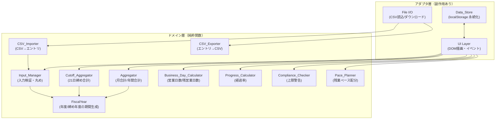
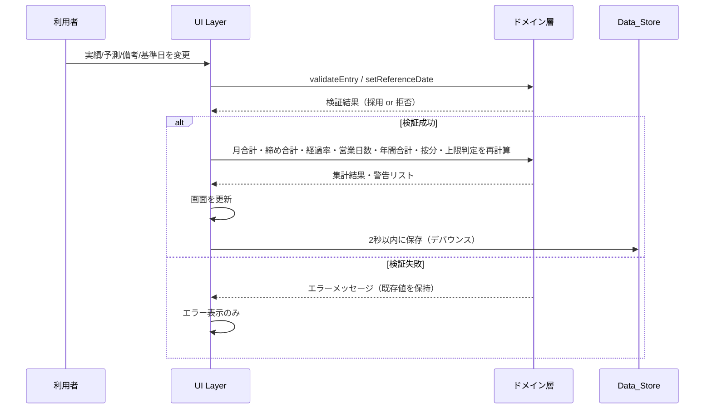

# 設計書（Design Document）

## Overview

Overtime Tracker は、サーバーを必要とせずローカルのブラウザで動作する単一ページアプリケーション（SPA）である。利用者は年度（4月1日〜翌年3月31日）単位で日次の残業実績・予測・備考を入力し、システムは月合計・21日締め合計・経過率・営業日数・年間合計・残業ペース配分を算出し、社内の残業上限ルールに対する警告を表示する。既存の「残業入力ツール.csv」「残業集計ツール.csv」と互換な CSV 入出力を備える。

本設計は、参照した 2 つの CSV から読み取ったデータ構造・列構成・業務ルール（CSV 備考欄）と、requirements.md の全 15 要件に基づく。中核となる計算ロジック（集計・経過率・営業日数・按分・上限判定・CSV 変換）はすべて副作用のない純粋関数として実装し、UI・永続化・ファイル入出力といった副作用を伴う層から分離する。これにより、ロジック層をプロパティベーステストで網羅的に検証できる構成とする。

### 設計目標

- **ローカル完結**: 外部ネットワーク接続を一切行わず、単一フォルダ内の HTML/JavaScript のみで起動する（要件14）。
- **計算の純粋性**: 集計・判定ロジックを純粋関数化し、テスト容易性と再計算の一貫性を確保する。
- **CSV 互換性**: 既存 CSV の列順・ヘッダ構成を保持し、入力 CSV についてはラウンドトリップ特性を満たす（要件11・12）。
- **リアクティブ再計算**: 日次データまたは基準日の変更時に、依存する全集計・警告を再計算して表示する。

### 参照 CSV から読み取った事実

- **入力ツール CSV**: ヘッダは `日付, 曜日, 実績, 予想（予測）, 備考`。日付は `YYYY/M/D` 形式。実績・予測は小数第1位（例: `4.0`, `3.1`, `0.7`）。空欄セルは未入力。備考には「有休」などの文字列が入る。
- **集計ツール CSV**: 月別に `月合計(1日〜末日)`, `月経過率(%)`, `21日締め合計(実績/予測)`, `営業日数`, `残営業日数`, `21日締め経過率(%)` を保持し、末尾に `合計` 行を持つ。備考欄に業務ルールが記載されている。
- **業務ルール（集計 CSV 備考欄）**:
  - 年度で 45 時間超えは 6 回まで（7 回目からアウト）。
  - 連続で 45 時間超えは避ける（印象が良くない）。
  - 45 時間を超える月は 55 時間以上になるよう調整する（47・48 は 45 時間以内に収められる範囲）。
  - 通常業務で 45 時間超えはアウト（障害対応などのイレギュラーのみ許可）。
  - 69 時間超えは一発アウト。
  - 3/21 始まりで年間 360 時間を超えてはいけない（特例でも 690 時間まで）。
  - 1 日 15 時間以上働けない。

## Architecture

アプリケーションは、副作用を持たない **ドメイン層（Core）** と、副作用を担う **アダプタ層（UI・永続化・ファイル入出力）** に分離する。



### レイヤの責務

| レイヤ | 責務 | 副作用 |
|--------|------|--------|
| ドメイン層 | 検証・集計・判定・CSV 文字列変換 | なし（純粋関数） |
| UI 層 | 状態保持、DOM 描画、イベントハンドリング、再計算のオーケストレーション | あり（DOM） |
| Data_Store | localStorage への保存・復元 | あり（ストレージ） |
| File I/O | CSV ファイルの読込（File API）とダウンロード（Blob） | あり（ファイル） |

### 再計算フロー

日次エントリまたは基準日が変更されると、UI 層が以下の順で再計算をオーケストレーションする。



### 技術選定

- **言語 / 実行環境**: バニラ JavaScript（ES Modules）+ HTML + CSS。ビルド不要でブラウザから直接開ける構成とする（要件14.3）。フレームワークは導入せず、外部 CDN も参照しない（要件14.2）。
- **永続化**: ブラウザの `localStorage`（オリジンローカル、ネットワーク非依存）。
- **CSV**: 外部ライブラリを使わず、ドメイン層内に最小限のパーサ／シリアライザを実装する。
- **テスト**: プロパティベーステストライブラリとして **fast-check**、テストランナーとして **Vitest** を用いる（ロジック層のみを対象とし、DOM は最小限のユニットテストで補完）。テストは開発時のみ利用し、成果物（配布物）はテスト依存を含まない。

## Components and Interfaces

ドメイン層のコンポーネントを純粋関数群として定義する。以下はインターフェース仕様（TypeScript 風の型注釈で表記。実装はバニラ JS + JSDoc）。

### FiscalYear（年度・締め年度の期間生成）

```typescript
// 年度開始年から年度の全日付を生成（要件1.1, 1.3, 1.4）
function fiscalYearDates(startYear: number): DateISO[]        // 4/1 〜 翌3/31
function fiscalYearMonths(startYear: number): YearMonth[]     // [ {y,m}, ... ] 4月〜翌3月の12件
// 締め期間: ある年月に対応する「前月21日〜当月20日」（要件5.1）
function cutoffPeriod(year: number, month: number): { start: DateISO, end: DateISO }
// 締め年度: 3/21 〜 翌3/20（要件10.2）
function cutoffYearPeriod(startYear: number): { start: DateISO, end: DateISO }
function weekdayOf(date: DateISO): Weekday                    // 月〜日（要件1.4）
function isValidCalendarDate(y: number, m: number, d: number): boolean  // 要件3.3
```

### Input_Manager（入力検証・丸め）

```typescript
// 残業時間の検証と丸め（要件2.1, 2.2, 2.5, 2.6, 2.7）
type HoursResult =
  | { ok: true, value: number }            // 0.1刻みに丸めた 0.0〜15.0未満
  | { ok: false, reason: 'not_number' | 'negative' | 'too_large' }
function parseHours(raw: string): HoursResult
function roundToTenth(value: number): number                 // 小数第2位以下を四捨五入

// 備考の検証（要件2.3, 2.8）
type NoteResult = { ok: true, value: string } | { ok: false, reason: 'too_long' }
function validateNote(raw: string): NoteResult               // 最大500文字
```

**設計上の注意**: 検証失敗時は既存値を保持する。ドメイン層は「採用すべき値」または「拒否理由」を返すだけで、状態の書き換えは UI 層が行う（純粋性の維持）。

### Aggregator（月合計・年間合計）

```typescript
// 対象残業時間の選択（要件3.4, 3.5）
function effectiveHours(entry: DailyEntry, referenceDate: DateISO): number | null
//   date <= referenceDate → actualHours、date > referenceDate → predictedHours、未入力は null

// 月合計（要件4）
function monthlyTotal(entries: DailyEntry[], year: number, month: number, referenceDate: DateISO): number
function allMonthlyTotals(entries: DailyEntry[], startYear: number, referenceDate: DateISO): MonthlyTotal[]

// 年間合計（要件8）
function annualActualTotal(entries: DailyEntry[], startYear: number): number
function annualPredictedTotal(entries: DailyEntry[], startYear: number): number
```

### Cutoff_Aggregator（21日締め合計）

```typescript
// 締め期間の実績合計・予測合計を独立して算出（要件5.1, 5.2, 5.4, 5.5）
function cutoffActualTotal(entries: DailyEntry[], year: number, month: number): number
function cutoffPredictedTotal(entries: DailyEntry[], year: number, month: number): number
function allCutoffTotals(entries: DailyEntry[], startYear: number): CutoffTotal[]
```

### Business_Day_Calculator（営業日数・残営業日数）

```typescript
// 平日（月〜金）を営業日とし、祝日/有休指定日は除外（要件7.1, 7.2, 7.4, 7.5）
function businessDays(start: DateISO, end: DateISO, excluded: Set<DateISO>): number
function remainingBusinessDays(start: DateISO, end: DateISO, referenceDate: DateISO, excluded: Set<DateISO>): number
//   referenceDate より後（当日を含まない）の平日数。referenceDate >= end なら 0
```

**祝日/有休の扱い（前提の確定）**: requirements.md 要件7.5 の前提に基づき、除外日集合 `excluded` を UI から与える方式とする。除外日の供給源は、(a) 日次エントリ備考が「有休」を含む日、(b) 利用者が任意に登録する祝日リスト、の 2 系統を合成する。祝日カレンダーの自動取得は行わない（ローカル動作要件14.2）。

### Progress_Calculator（経過率）

```typescript
// 経過営業日数 / 総営業日数 × 100（小数第1位、0.0〜100.0）（要件6）
function progressRate(periodStart: DateISO, periodEnd: DateISO, referenceDate: DateISO, excluded: Set<DateISO>): number
//   referenceDate >= periodEnd → 100.0、referenceDate < periodStart → 0.0、総営業日数0 → 0.0
```

### Compliance_Checker（上限警告）

```typescript
type Warning = {
  code: 'OVER_45' | 'OVER_45_COUNT' | 'CONSECUTIVE_45' | 'ADJUST_TO_55'
      | 'OVER_69' | 'CUTOFF_YEAR_360' | 'CUTOFF_YEAR_690'
  months?: YearMonth[]
  value?: number
  limit?: number
  message: string
}
// 月45時間関連（要件9）と絶対上限（要件10）を評価
function evaluateCompliance(
  monthlyTotals: MonthlyTotal[],
  cutoffYearTotal: number
): Warning[]
```

判定規則（CSV 備考欄と要件9・10より）:
- `OVER_45`: 月合計 > 45.0（ちょうどは含めない）。
- `OVER_45_COUNT`: 年度内の 45 時間超過月数 >= 7。
- `CONSECUTIVE_45`: 暦月として連続する 2 か月がともに > 45.0。
- `ADJUST_TO_55`: 月合計 > 45.0 かつ < 55.0。
- `OVER_69`: 月合計 > 69.0（重大警告）。
- `CUTOFF_YEAR_360`: 締め年度合計 > 360.0 かつ <= 690.0。
- `CUTOFF_YEAR_690`: 締め年度合計 > 690.0（重大警告）。

### Pace_Planner（残業ペース配分）

```typescript
// 残業ペース配分（要件15）
type PacePlan =
  | { kind: 'normal', remainingBudget: number, remainingMonths: number, monthlyAllowance: number }
  | { kind: 'over_cap', remainingBudget: number, monthlyAllowance: 0.0 }   // 予算 < 0
  | { kind: 'year_ended' }                                                 // 残り月数 0
function computePacePlan(
  entries: DailyEntry[], startYear: number, referenceDate: DateISO, annualCap?: number  // 既定 360.0
): PacePlan
//   remainingBudget = annualCap −（年度内で基準日以前の実績合計）
//   remainingMonths = 基準日が属する月〜翌3月（属する月を含む）
//   monthlyAllowance = remainingBudget / remainingMonths（小数第1位）
```

### CSV_Importer / CSV_Exporter

```typescript
// インポート（要件11）
type ImportResult =
  | { ok: true, entries: DailyEntry[] }
  | { ok: false, lineNumber: number, reason: string }
function importInputCsv(text: string): ImportResult

// エクスポート（要件12）
function exportInputCsv(entries: DailyEntry[]): string        // 日付昇順、入力ツール互換
function exportSummaryCsv(summary: SummaryModel): string      // 集計ツール互換
```

### アダプタ層インターフェース

```typescript
// Data_Store（要件13）
interface DataStore {
  save(state: AppState): Promise<void>       // 2秒デバウンス
  load(): AppState | null                    // 破損時は null（要件13.4）
}
// File I/O（要件11, 12, 14.4）
interface FileIO {
  readTextFile(file: File): Promise<string>
  downloadCsv(filename: string, content: string): void
  checkRequiredAssets(): { ok: true } | { ok: false, missing: string[] }  // 要件14.4
}
```

## Data Models

```typescript
// 日付は "YYYY-MM-DD" 正規化文字列で内部保持（CSV 入出力時に YYYY/M/D と相互変換）
type DateISO = string
type Weekday = '月' | '火' | '水' | '木' | '金' | '土' | '日'
type YearMonth = { year: number, month: number }

// 日次エントリ（要件1.3, 1.4, 2）
interface DailyEntry {
  date: DateISO          // 正規化日付
  weekday: Weekday       // date から導出、保存もする
  actualHours: number | null    // 実績。未入力は null。0.0〜15.0未満、0.1刻み
  predictedHours: number | null // 予測。未入力は null。0.0〜15.0未満、0.1刻み
  note: string           // 備考。最大500文字。既定は ""
}

// 年度状態（要件1）
interface FiscalYearState {
  startYear: number              // 年度開始年（例: 2026）
  entries: DailyEntry[]          // 4/1〜翌3/31 の全日付分（365 または 366 件）、日付昇順
}

// アプリ全体の永続化状態（要件13）
interface AppState {
  referenceDate: DateISO         // 基準日/本日（要件3）
  selectedStartYear: number      // 現在選択中の年度
  fiscalYears: FiscalYearState[] // 作成済み年度の集合
  excludedDates: DateISO[]       // 祝日・有休など営業日から除外する日（要件7.5）
  annualCap: number              // 年間残業上限。既定 360.0（要件15.1）
  schemaVersion: number          // 破損検知/移行用
}

// 集計結果モデル（表示・エクスポート用、要件4〜8, 12.2）
interface MonthlyTotal { year: number, month: number, total: number }
interface CutoffTotal { year: number, month: number, actualTotal: number, predictedTotal: number }
interface SummaryRow {
  month: number
  monthlyTotal: number
  monthProgressRate: number
  cutoffActual: number
  cutoffPredicted: number
  businessDays: number
  remainingBusinessDays: number
  cutoffProgressRate: number
}
interface SummaryModel {
  rows: SummaryRow[]             // 4月〜翌3月
  referenceDate: DateISO
  annualActualTotal: number
  annualPredictedTotal: number
}
```

### データ表現に関する決定

- **日付の内部表現**: 曖昧さと並び順の安定性のため、内部では `YYYY-MM-DD`（ゼロ埋め）で保持する。CSV は入力ツール互換の `YYYY/M/D`（ゼロ埋めなし）で入出力し、境界で相互変換する。
- **未入力の表現**: `null` を「集計対象外（空欄）」の唯一の表現とする（要件2.4, 4.4, 5.5, 8.4）。CSV では空文字セルに対応（要件12.3）。
- **丸め規約**: すべての時間値は「小数第2位以下を四捨五入して小数第1位」に統一（要件2.1, 2.2）。集計・按分・経過率の丸めも同一規約に従う。
- **年度と締め年度の非対称性**: ペース配分（要件15）は年度（4/1〜3/31）ベース、絶対上限の 360/690 判定（要件10）は締め年度（3/21〜3/20）ベースで、意図的に別期間を用いる。両者は独立の集計として保持する。

## Correctness Properties

*プロパティとは、システムのすべての有効な実行にわたって成り立つべき特性や振る舞いであり、システムが何をすべきかを形式的に述べたものである。プロパティは、人間が読める仕様と機械的に検証可能な正しさの保証との橋渡しをする。*

以下の各プロパティは受け入れ基準（prework 分析）から導出し、冗長性を排除して統合した。各プロパティはプロパティベーステストで最低 100 回の反復で検証する。

### Property 1: 年度期間の不変条件

*任意の* 年度開始年 `startYear` について、`fiscalYearDates(startYear)` の初日は `startYear/4/1`、末日は `(startYear+1)/3/31` である。

**Validates: Requirements 1.1**

### Property 2: 年度日数生成の正しさ

*任意の* 年度開始年について、生成される日次エントリの件数は 4/1〜翌3/31 の実日数（平年365、翌暦年が閏年なら366）に等しく、全日付が一意・連続・日付昇順である。

**Validates: Requirements 1.3**

### Property 3: 曜日付与の正しさ

*任意の* 有効な日付について、`weekdayOf(date)` はその日付の暦上の曜日に一致する。

**Validates: Requirements 1.4**

### Property 4: 残業時間の丸めと範囲

*任意の* 実数 `x`（0.0 <= x < 15.0）について、`parseHours` は `x` を小数第1位に四捨五入した値（丸め誤差 <= 0.05）を採用し、その結果は 0.0 以上 15.0 未満かつ 0.1 の整数倍である。この規則は実績・予測の双方に共通して適用される。

**Validates: Requirements 2.1, 2.2**

### Property 5: 備考の受理

*任意の* 500 文字以内の文字列について、`validateNote` は受理し、保存される値は入力文字列と一致する。

**Validates: Requirements 2.3**

### Property 6: 負の残業時間の拒否

*任意の* 0 未満の数値入力について、`parseHours` は拒否理由 `negative` で拒否する（既存値は保持される）。

**Validates: Requirements 2.5**

### Property 7: 過大な残業時間の拒否

*任意の* 15.0 以上の数値入力について、`parseHours` は拒否理由 `too_large` で拒否する（既存値は保持される）。

**Validates: Requirements 2.6**

### Property 8: 非数値入力の拒否

*任意の* 数値として解釈できない文字列について、`parseHours` は拒否理由 `not_number` で拒否する。

**Validates: Requirements 2.7**

### Property 9: 過長な備考の拒否

*任意の* 500 文字を超える文字列について、`validateNote` は拒否理由 `too_long` で拒否する（既存備考は保持される）。

**Validates: Requirements 2.8**

### Property 10: 無効な基準日の拒否

*任意の* 実在しない年月日について、`isValidCalendarDate` は false を返し、基準日設定は拒否されて変更前の基準日が保持される。

**Validates: Requirements 3.3**

### Property 11: 対象残業時間の選択

*任意の* 日次エントリと基準日について、対象日が基準日以前なら `effectiveHours` は実績残業時間を、基準日より後なら予測残業時間を返す（当該列が未入力なら null）。

**Validates: Requirements 3.4, 3.5**

### Property 12: 月合計の集計

*任意の* 日次エントリ集合・年度・基準日について、ある月の月合計は、その月の各日の対象残業時間（`effectiveHours`、未入力日は除外）の総和を小数第1位に丸めた値に等しい。

**Validates: Requirements 4.1, 4.4, 2.4**

### Property 13: 年度は12か月を網羅

*任意の* データについて、`allMonthlyTotals` は当該年度の4月から翌年3月までのちょうど12件を返す。

**Validates: Requirements 4.3**

### Property 14: 21日締め合計の実績・予測独立集計

*任意の* 日次エントリ集合と年月について、締め期間（前月21日〜当月20日）の実績合計は期間内の実績（非null）の総和、予測合計は期間内の予測（非null）の総和にそれぞれ等しく、`allCutoffTotals` は12件を返す。

**Validates: Requirements 5.1, 5.2, 5.4, 5.5**

### Property 15: 経過率の定義と範囲

*任意の* 期間・基準日・除外日集合について、経過率は「（期間初日から基準日まで（基準日含む）の営業日数）÷（期間の総営業日数）× 100」を小数第1位に丸めた値であり、常に 0.0 以上 100.0 以下である。基準日が期間末日以降なら 100.0、期間初日より前なら 0.0、総営業日数が 0 なら 0.0 となる。この規則は月経過率・21日締め経過率の双方に適用される。

**Validates: Requirements 6.1, 6.2, 6.3, 6.4, 6.5**

### Property 16: 営業日数の算出

*任意の* 期間について、除外日がないときの営業日数は期間内の平日（月〜金）の数に等しい。

**Validates: Requirements 7.1**

### Property 17: 残営業日数の算出

*任意の* 期間と基準日について、残営業日数は基準日より後（基準日当日を含まない）の平日数に等しく、常に営業日数以下である。基準日が期間末日以降なら 0 となる。

**Validates: Requirements 7.2, 7.4**

### Property 18: 除外日のメタモルフィック性

*任意の* 期間と、期間内の平日である日について、その日を除外日集合に追加すると、営業日数はちょうど 1 減少する（既に除外済みの日を追加した場合は不変）。

**Validates: Requirements 7.5**

### Property 19: 年間合計の集計

*任意の* 日次エントリ集合について、年間実績合計は年度内の実績（非null）の総和、年間予測合計は年度内の予測（非null）の総和に等しい（未入力日は除外）。

**Validates: Requirements 8.1, 8.2, 8.4**

### Property 20: 45時間超過月の判定

*任意の* 月合計集合について、`OVER_45` の対象となる月の集合は、月合計が 45.0 を超える（45.0 ちょうどは含まない）月の集合に厳密に一致する。月合計が 45.0 以下になれば、再評価結果に当該月の 45 時間系警告は含まれない。

**Validates: Requirements 9.1, 9.5**

### Property 21: 45時間超過回数の上限警告

*任意の* 月合計集合について、45.0 を超える月の数が 7 以上であるとき、かつそのときに限り `OVER_45_COUNT` 警告が生成される。

**Validates: Requirements 9.2**

### Property 22: 連続超過の判定

*任意の* 年度内の月合計系列について、暦月として連続する2か月がともに 45.0 を超えるペアが存在するとき、かつそのときに限り `CONSECUTIVE_45` 警告が生成され、該当ペアが示される。

**Validates: Requirements 9.3**

### Property 23: 55時間への調整警告

*任意の* 月合計について、その値が 45.0 を超え 55.0 未満であるとき、かつそのときに限り当該月に `ADJUST_TO_55` 警告が生成される。

**Validates: Requirements 9.4**

### Property 24: 69時間超過の重大警告

*任意の* 月合計について、その値が 69.0 を超えるとき、かつそのときに限り当該月に `OVER_69` 重大警告が生成される。

**Validates: Requirements 10.1**

### Property 25: 締め年度合計の集計

*任意の* 日次エントリ集合と締め年度について、締め年度合計は締め年度期間（3/21〜翌3/20）内の各日の対象残業時間（`effectiveHours`）の総和に等しい。

**Validates: Requirements 10.2**

### Property 26: 締め年度上限の閾値分類

*任意の* 締め年度合計について、値が 360.0 を超え 690.0 以下なら `CUTOFF_YEAR_360` 警告のみ、690.0 を超えるなら `CUTOFF_YEAR_690` 重大警告が生成され、360.0 以下ならいずれも生成されない。この分類は再評価時も入力のみに依存して決まる。

**Validates: Requirements 10.3, 10.4, 10.5**

### Property 27: 入力CSVのラウンドトリップ

*任意の* 有効な日次エントリ集合について、入力 CSV へ書き出し（`exportInputCsv`）、再度読み込む（`importInputCsv`）と、全エントリの日付・曜日・実績・予測・備考の各項目が元と一致し、日付昇順が保持される。未入力項目は空セルとして往復する。

**Validates: Requirements 12.4, 12.3, 11.3, 11.1**

### Property 28: 日付不正行のインポート拒否

*任意の* 有効な入力 CSV について、任意の1データ行の日付を `YYYY/M/D` として解釈できない値に置換すると、`importInputCsv` は該当する行番号を伴うエラーを返し、取り込みを中止する。

**Validates: Requirements 11.2**

### Property 29: セル値不正行のインポート拒否

*任意の* 有効な入力 CSV について、任意の1データ行の実績または予測を、数値として解釈できない値、または 0 未満もしくは 15.0 以上の値に置換すると、`importInputCsv` は該当する行番号を伴うエラーを返し、取り込みを中止する。

**Validates: Requirements 11.5, 11.6**

### Property 30: 入力CSVの構造

*任意の* 日次エントリ集合について、`exportInputCsv` の出力は入力ツール互換のヘッダ行（日付・曜日・実績・予測・備考）で始まり、各データ行は 5 列を持ち、データ行は日付昇順である。出力対象が空なら出力はヘッダ行のみとなる。

**Validates: Requirements 12.1, 12.5**

### Property 31: 集計CSVの構造

*任意の* `SummaryModel` について、`exportSummaryCsv` の出力は集計ツール互換のヘッダ（月・月合計・月経過率・21日締め合計(実績)・21日締め合計(予測)・営業日数・残営業日数・21日締め経過率・本日）を規定の列順で含み、12 か月分の行と合計行を持つ。

**Validates: Requirements 12.2**

### Property 32: 永続化状態のシリアライズ往復

*任意の* `AppState` について、シリアライズしてデシリアライズすると元の状態に一致する（保存・復元でデータが失われない）。

**Validates: Requirements 13.2**

### Property 33: 残余残業予算の算出

*任意の* 日次エントリ集合・基準日・年間上限について、残余残業予算は「年間上限 −（年度内で基準日以前の実績残業時間の合計）」に等しい。

**Validates: Requirements 15.2**

### Property 34: 残り月数の算出

*任意の* 年度内の基準日について、残り月数は基準日が属する月から翌年3月までの月数（属する月を含む）に等しく、1 以上 12 以下である。

**Validates: Requirements 15.3**

### Property 35: 月あたり配分の算出と超過時の扱い

*任意の* 日次エントリ集合・基準日について、残り月数が 1 以上かつ残余予算が 0 以上なら、月あたり配分は「残余予算 ÷ 残り月数」を小数第1位に丸めた値に等しい。残余予算が 0 未満なら月あたり配分は 0.0 となり超過警告を伴う。残り月数が 0 なら配分は算出されない（年度終了）。

**Validates: Requirements 15.4, 15.5, 15.6**

## Error Handling

エラーは「入力検証エラー（回復可能・ユーザ通知）」「インポートエラー（中止・行番号提示）」「永続化エラー（メモリ保持・通知）」「起動エラー（中止・欠落提示）」に分類する。ドメイン層は例外を投げず、結果型（`{ok:false, reason}` 等）でエラーを表現する。副作用を伴う失敗（ストレージ・ファイル）のみアダプタ層で例外を捕捉する。

| エラー種別 | 発生源 | 検出方法 | ユーザへの表示 | 状態への影響 | 要件 |
|-----------|--------|----------|----------------|--------------|------|
| 負値/過大/非数値の残業入力 | Input_Manager | `parseHours` の結果型 | 該当理由のメッセージ（0以上／15未満／数値を入力） | 既存値を保持 | 2.5, 2.6, 2.7 |
| 備考過長 | Input_Manager | `validateNote` | 500文字以内である旨 | 既存備考を保持 | 2.8 |
| 無効な基準日 | FiscalYear | `isValidCalendarDate` | 有効な日付を促す | 変更前の基準日を保持 | 3.3 |
| 既存年度の再作成 | UI + FiscalYear | 既存 startYear の照合 | 当該年度は既存である旨 | 既存エントリを保持 | 1.5 |
| 日付形式不正（CSV） | CSV_Importer | 行走査で `YYYY/M/D` 解釈失敗 | 行番号付きエラー | 取り込み中止、既存保持 | 11.2 |
| セル値不正/範囲外（CSV） | CSV_Importer | 行走査で数値化・範囲検査失敗 | 行番号付きエラー | 取り込み中止、既存保持 | 11.5, 11.6 |
| 保存データ破損 | Data_Store | JSON 解析失敗／schemaVersion 不整合 | 復元失敗の旨 | 空状態で起動 | 13.4 |
| 保存失敗（容量不足等） | Data_Store | `setItem` 例外（QuotaExceededError 等） | 保存失敗の旨 | メモリ上に全データ保持 | 13.5 |
| 必要ファイル欠落 | File I/O | `checkRequiredAssets` | 不足ファイルを提示 | 起動中止 | 14.4 |

**再計算の一貫性**: すべての集計・警告はドメイン層の純粋関数で、現在の入力状態のみから導出される。過去の警告状態を保持しないため、値が基準を下回れば警告は自動的に解除される（要件9.5, 10.5）。

## Testing Strategy

### Dual Testing Approach

- **プロパティテスト**: 上記 Correctness Properties（Property 1〜35）を、ドメイン層の純粋関数に対して検証する。集計・経過率・営業日数・按分・上限判定・CSV 変換など、入力で振る舞いが変化しエッジケースが豊富な中核ロジックに適用する。
- **ユニットテスト（例示・エッジ）**: UI 表示・トリガ挙動・具体的な状態遷移など、普遍性の薄い受け入れ基準を例示テストで補完する（1.2, 1.5, 1.6, 3.1, 3.2, 4.2, 5.3, 7.3, 8.3, 11.4, 13.3, 14.4, 15.1, 15.7）。エッジケース（4.5, 6.3〜6.5, 7.4, 8.5, 12.5, 15.5）は主にプロパティテストの生成器で境界値を網羅しつつ、代表例を明示テストで固定する。
- **統合/スモークテスト**: 副作用や構成に関する基準を担当する。永続化のタイミング（13.1）・保存失敗（13.5）は Data_Store のモックで検証する。ローカル動作・外部接続なし・単一フォルダ起動（14.1〜14.3）は、`file://` での起動確認と、外部参照が存在しないことの静的確認によるスモークテストとする。

### PBT がこの機能に適する理由

本機能の中核は、日次データから集計値・警告・CSV を導出する純粋関数群である。丸め・境界（45/55/69/360/690 時間）・閏年・締め期間の月またぎ・空欄処理など、入力空間が広くエッジが多いため、100 回以上のランダム反復が具体例テストより多くのバグを発見できる。CSV パーサ／シリアライザはラウンドトリップ特性（Property 27）で強く検証する。一方、UI 描画・localStorage・ファイル I/O は入力で振る舞いが変わらないため PBT の対象外とし、例示・統合・スモークで扱う。

### プロパティテストの構成

- **ライブラリ**: fast-check（プロパティ生成）+ Vitest（ランナー）。プロパティベーステストを自前実装しない。
- **反復回数**: 各プロパティテストは最低 100 回反復する（`fc.assert(..., { numRuns: 100 })`）。
- **タグ付け**: 各プロパティテストに、対応する設計プロパティを示すコメントを付す。
  - 形式: **Feature: overtime-tracker, Property {番号}: {プロパティ本文}**
- **単一対応**: 各 Correctness Property は 1 つのプロパティベーステストで実装する。

### ジェネレータ設計（主なもの）

- **時間値**: `fc.double({ min: 0, max: 14.99, noNaN: true })` と、範囲外（負・15以上）・非数値文字列の各生成器を用意（Property 4, 6, 7, 8, 29）。
- **日付/年度**: 妥当な `startYear` 範囲（例 2000〜2100）と、閏年・非閏年、月末・締め境界（20日/21日）、3/20・3/21 をまたぐ日付を含める生成器（Property 1, 2, 14, 25, 34）。
- **日次エントリ集合**: 年度内の日付部分集合に対し、実績/予測を「値 or null」で割り当てる生成器（未入力の混在をカバー、Property 12, 19, 27）。
- **除外日**: 期間内の平日から任意個を選ぶ生成器（Property 18）。
- **月合計系列**: 45/55/69 の境界近傍を意図的に含む 12 要素の生成器（Property 20〜24）。
- **AppState**: 上記を組み合わせた完全状態の生成器（Property 32）。

### ユニット/例示テストの範囲

具体例・整数点の確認（例: 参照 CSV の 8月 月経過率 19.4%、実績合計 322.3 などの既知値との突き合わせ）を回帰テストとして固定し、丸め・経過率の実装がサンプルデータと整合することを保証する。プロパティテストが広域をカバーするため、ユニットテストは代表例・統合点・エラー表示に絞り、過剰に作成しない。
